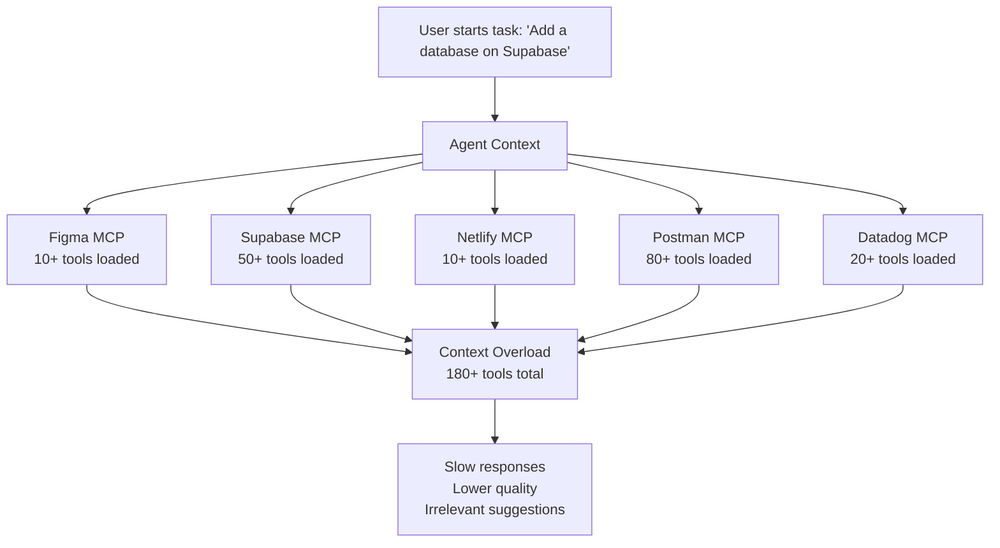
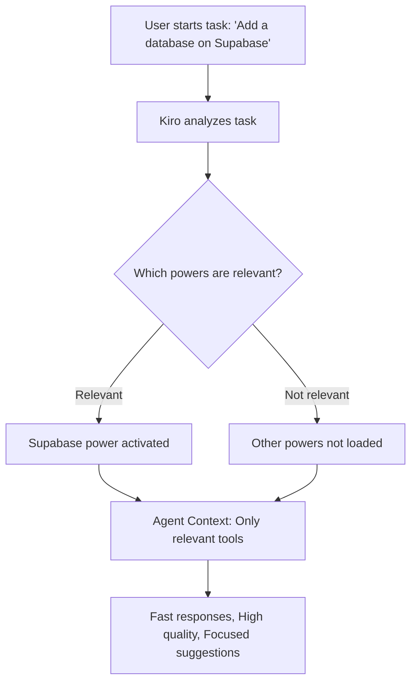

#### Overview

**Kiro Powers** are a modern approach to enhancing the capabilities of AI Agents in the Kiro IDE.

Each Power packages specialized tools and workflows for specific development tasks in a format that Kiro can activate on demand. When relevant keywords are mentioned, Kiro automatically loads the feature's context and tools.

#### The Problem Kiro Powers Solve

- **Too much context makes agents slow down.** Connecting multiple MCP servers at the same time can consume tens of thousands of tokens before a single line of code is written, leaving the agent "overwhelmed" and slowing its responses.

- **Without framework-specific context, agents are left to guess.** A general-purpose AI may be able to call a third-party API such as Stripe or Supabase, but it may not know the implicit best practices, such as using idempotency keys with Stripe or configuring connection pooling for serverless applications. Kiro Powers solve this by providing an integrated "expert guide."



#### How It Works

Instead of loading all MCP tools at once, capabilities are activated dynamically based on keywords in your conversation.



The workflow is simple:
1. The user sends a prompt
2. Kiro reads the task
3. Kiro matches keywords with the installed Powers
4. Only the relevant Power is loaded into the context
5. The agent uses that Power's knowledge and tools

Example: The prompt "Design a payment flow with Stripe" activates the Stripe Power.

#### Components

Powers follow the Agent Plugins specification, an open, vendor-neutral format for packaging reusable components that extend AI agents. A Power is a directory with one required manifest file and optional components:
1. **plugin.json** - The manifest that identifies the Power and declares the keywords that activate it.
2. **skills/** - Agent Skills that provide task-specific instructions, scenarios, and reference material.
3. **mcp.json** - MCP server configuration for tool integration (optional).
4. **dev.kiro/** - Kiro-specific extensions, such as steering files (optional).

```txt
my-power/
├── plugin.json          # Required manifest
├── skills/              # Agent Skills
│   └── setup/
│       ├── SKILL.md
│       └── references/
└── mcp.json             # MCP server configuration
```

{}
Powers built with the original POWER.md format continue to work. For new Powers, we recommend using the Agent Plugins format. You can convert existing Powers using Power Builder.
{}

#### Differences Between Powers, Skills, and Steering

| Concept | Definition | Support/Components | Use Case |
| --- | --- | --- | --- |
| **Powers** | Plugins that integrate MCP tools, skills, and knowledge into a single installable package and activate dynamically based on context. | Can contain Skills as components. | Use for integrations that require both tools and guidance. |
| **Skills** | Standalone, portable instruction packages that guide agents through specific tasks. | Can exist independently or be bundled inside a Power. | Use for reusable workflows that you want to share or import. |
| **Steering** | Kiro-specific context that shapes agent behavior. | Supports: `always`, `auto`, `fileMatch`, `manual`. | Use for project standards and conventions. |
