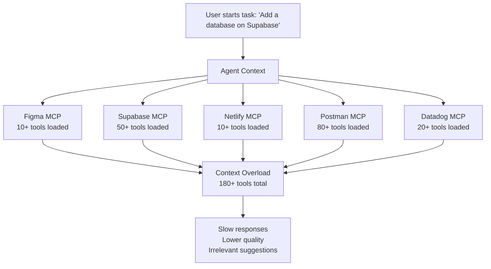
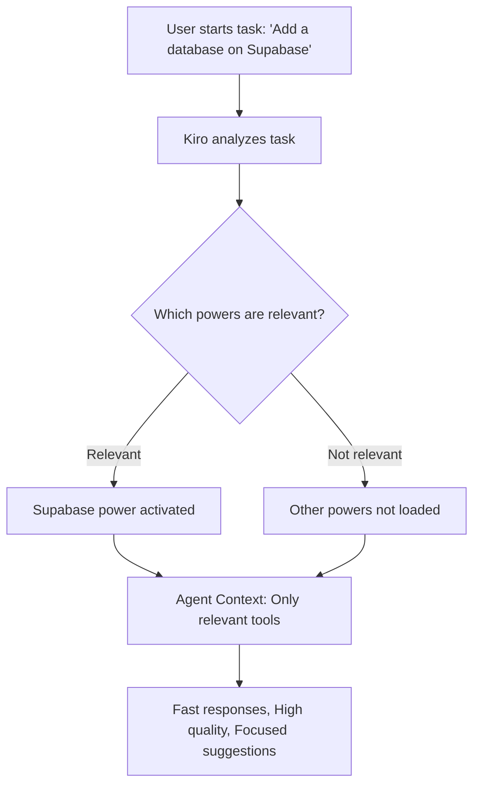

#### Tổng quan

**Kiro Powers** là cách tiếp cận hiện đại để tăng cường khả năng của AI Agent trong Kiro IDE. 

Mỗi Power (Năng lực) đóng gói công cụ và quy trình làm việc chuyên biệt cho các nhiệm vụ phát triển cụ thể vào một định dạng mà Kiro có thể kích hoạt theo yêu cầu. Khi được đề cập đến các từ khóa liên quan, Kiro sẽ tự động tải ngữ cảnh và các công cụ của tính năng đó.

#### Vấn đề mà Kiro Powers đã giải quyết

- **Với quá nhiều ngữ cảnh, các tác nhân sẽ hoạt động chậm lại.** Kết nối nhiều MCP servers cùng lúc có thể tiêu tốn hàng chục nghìn token trước khi viết dòng code nào, khiến agent bị "ngợp" và phản hồi chậm.

- **Thiếu ngữ cảnh khung, các tác nhân chỉ biết đoán mò.** AI thông thường có thể gọi API của bên thứ ba (như Stripe, Supabase) nhưng không biết các quy chuẩn ngầm (ví dụ: dùng idempotent keys cho Stripe hay cấu hình connection pooling cho serverless). Kiro Powers giải quyết triệt để vấn đề này bằng cách cung cấp "sách hướng dẫn chuyên sâu" tích hợp sẵn.



#### Cơ chế hoạt động

Thay vì tải tất cả các công cụ MCP cùng một lúc, các chức năng sẽ được kích hoạt động dựa trên các từ khóa trong cuộc hội thoại của bạn.



Luồng hoạt động đơn giản:
1. Người dùng gửi prompt
2. Kiro đọc nội dung task
3. So khớp keywords với các Power đã cài
4. Chỉ load Power phù hợp vào context
5. Agent sử dụng kiến thức + tools của Power đó

Ví dụ: Promp “Thiết kế flow thanh toán với Stripe” -> Stripe Power được kích hoạt

#### Các thành phần

Các Power tuân theo đặc tả Agent Plugins — một định dạng mở, trung lập với nhà cung cấp, dùng để đóng gói các thành phần có thể tái sử dụng nhằm mở rộng các tác nhân AI. Một Power là một thư mục với một tệp kê khai bắt buộc và các thành phần tùy chọn:
1. **plugin.json** — Tệp kê khai xác định nguồn điện và khai báo các từ khóa để kích hoạt nó.
2. **skills/** — Kỹ năng của Đặc vụ cung cấp hướng dẫn cụ thể cho từng nhiệm vụ, kịch bản và tài liệu tham khảo
3. **mcp.json** — Cấu hình máy chủ MCP cho việc tích hợp công cụ (tùy chọn)
4. **dev.kiro/** — Các phần mở rộng dành riêng cho Kiro, ví dụ như các tệp điều khiển (tùy chọn)

```txt
my-power/
├── plugin.json          # Required manifest
├── skills/              # Agent Skills
│   └── setup/
│       ├── SKILL.md
│       └── references/
└── mcp.json             # MCP server configuration
```

{}
Các Power được xây dựng bằng định dạng POWER.md gốc vẫn hoạt động bình thường. Đối với các Power mới, chúng tôi khuyên bạn nên sử dụng định dạng Agent Plugins. Bạn có thể chuyển đổi các Power hiện có bằng cách sử dụng Power Builder.
{}

#### Sự khác biệt giữa powers, skills và steering

| Khái niệm | Định nghĩa | Hỗ trợ/Thành phần | Trường hợp sử dụng |
| --- | --- | --- | --- |
| **Powers** | Các plugin tích hợp các công cụ, kỹ năng và kiến thức của MCP vào một gói cài đặt duy nhất, kích hoạt động dựa trên ngữ cảnh. | Có thể chứa các kỹ năng như các thành phần. | Sử dụng cho các tích hợp mà bạn cần cả công cụ và hướng dẫn. |
| **Kỹ năng (Skills)** | Các gói hướng dẫn độc lập, di động, hướng dẫn các tác nhân thực hiện các nhiệm vụ cụ thể. | Có thể tồn tại độc lập hoặc đóng gói bên trong một power. | Sử dụng cho các quy trình làm việc có thể tái sử dụng muốn chia sẻ hoặc nhập khẩu. |
| **Điều khiển (Controls)** | Ngữ cảnh đặc thù của Kiro giúp định hình hành vi của tác nhân. | Hỗ trợ: `always`, `auto`, `fileMatch`, `manual`. | Sử dụng cho các tiêu chuẩn và quy ước của dự án. |
